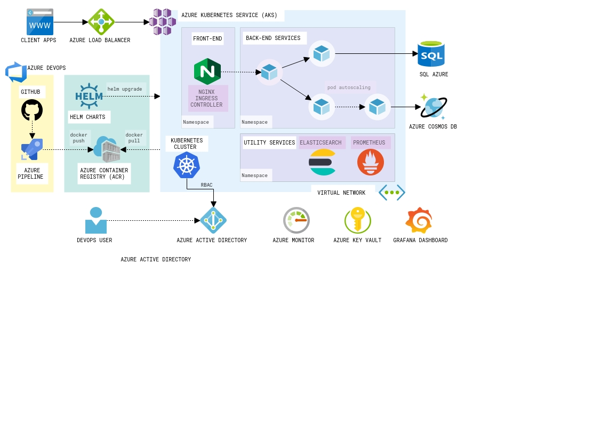

# AWS, AZURE and GCP
@Author Abraão Silva
In this repository different models of architectures are presented to implement systems in the cloud with AWS, AZURE and AKS.

## Architecture AZURE

  

### Features AWS:
* EC2
* RDS
* Route 53
* Clud Front
* S3
* Security Group
* ELB

## Requirements
* Draw.io is a completely free diagram editor. (e.g. [draw.io](https://www.draw.io/));

## Configuration
*  Open Existing Diagram
*  Enter Value : herediasamuel/aws/master
*  Select the extension .xml diagram you want to see 
